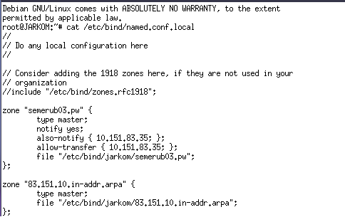
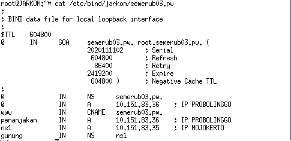
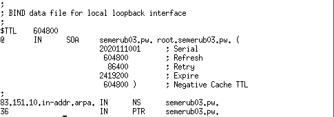
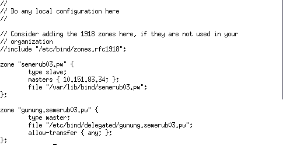
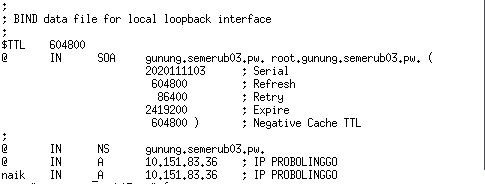
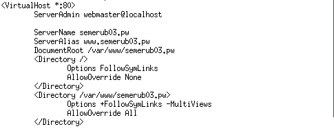
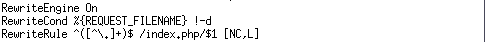

# Jarkom_Modul2_Lapres_B03

### 1. Website utama dengan alamat `http://semerub03.pw` 
- Jalankan perintah `nano /etc/bind/named.conf.local`.
- Konfigurasi `semerub03.pw` diisi dengan syntax

```
zone "semerub03.pw" {
    type master;
    file "/etc/bind/jarkom/semerub03.pw";
};
```



- Buat folder `jarkom` di dalam `/etc/bind`
- Copykan file `db.local` ke dalam folder jarkom dan namanya diubah menjadi `semerub03.pw`.


### 2. Memiliki alias `http://www.semerub03.pw`
- Membuat record CNAME

### 3. Memiliki subdomain `http://penanjakan.semerub03.pw` yang diatur DNS-nya pada MALANG dan mengarah ke IP Server PROBOLINGGO
- File `/etc/bind/jarkom/semeru03.pw` diedit lalu subdomain ditambahkan



### 4. Reverse domain untuk domain utama.
- Edit file `/etc/bind/named.conf.local`
- Tambahkan konfigurasi 
```
zone "83.151.10.in-addr.arpa" {
    type master;
    file "/etc/bind/jarkom/83.151.10.in-addr.arpa";
};
```
- copy file `db.local` ke dalam folder `jarkom` dan namanya diubah menjadi `83.151.10.in-addr.arpa`
- File `83.151.10.in-addr.arpa` diedit



### 5. DNS Server Slave pada MOJOKERTO 
- Edit file `/etc/bind/named.conf.local`
- Lakukan restart bind9
- Update package list pada server MOJOKERTO
- Install aplikasi bind9
- Buka file `/etc/bind/named.conf.local`



### 6. Subdomain dengan alamat `http://gunung.semerub03.pw` yang didelegasikan pada server MOJOKERTO dan mengarah ke IP Server PROBOLINGGO.
- Pada PROBOLINGGO, edit file `/etc/bind/jarkom/gunung.semerub03.com`
- Edit file `/etc/bind/named.conf.options`
- Comment `dnssec-validation auto`
- Tambahkan baris `allow-query{any;};`
- File `/etc/bind/named.conf.local` diedit
- Restart bind9
- pada MOJOKERTO edit file `/etc/bind/named.conf.options`
- Comment `dnssec-validation auto`
- Tambahkan baris `allow-query{any;};`
- File `/etc/bind/named.conf.local` diedit
- Direktori dengan nama delegasi dibuat




### 7. Subdomain dengan nama `http://naik.gunung.semerub03.pw`, domain ini diarahkan ke IP Server PROBOLINGGO.
- File `/etc/bind/jarkom/gunung.semeru03.pw` diedit lalu subdomain ditambahkan


### 8. Domain `http://semerub03.pw` memiliki DocumentRoot pada `/var/www/semerub03.pw`.
- Diubah menjadi `<Directory /var/www/semerub03.pw>`
- Lakukan `service apache2 restart`



### 9. Diaktifkan mod rewrite agar urlnya menjadi `http://semerub03.pw/home`.
- Perintah `a2enmod rewrite` dijalankan
- Apache di restart
- Buat file `.htaccess` di directory `/var/www/semerub03.pw`



### 11. Pada folder `/public` dibolehkan directory listing namun untuk folder yang berada di dalamnya tidak dibolehkan.

### 12. Untuk mengatasi HTTP Error code 404, disediakan file `404.html` pada folder `/errors` untuk mengganti error default 404 dari Apache.

### 13. Untuk mengakses file assets javascript awalnya harus menggunakan url `http://penanjakan.semerub03.pw/public/javascripts`. Karena terlalu panjang maka dibuatkan konfigurasi virtual host agar ketika mengakses file assets menjadi `http://penanjakan.semerub03.pw/js`.

### 14. Web `http://naik.gunung.semerub03.pw` sudah bisa diakses hanya dengan menggunakan port 8888. DocumentRoot web berada pada `/var/www/naik.gunung.semerub03.pw`.

### 15. Web `http://naik.gunung.semerub03.pw` bersifat private. Dibuat web `http://naik.gunung.semerub03.pw` dan diberi autentikasi password dengan username `“semeru”` dan password `“kuynaikgunung”`

### 16. Pengunjung IP PROBOLINGGO akan dialihkan secara otomatis ke `http://semerub03.pw`.

### 17. Karena pengunjung pada `/var/www/penanjakan.semerub03.pw/public/images` sangat banyak maka semua request gambar yang memiliki substring `“semeru”` akan diarahkan menuju `semeru.jpg`.
